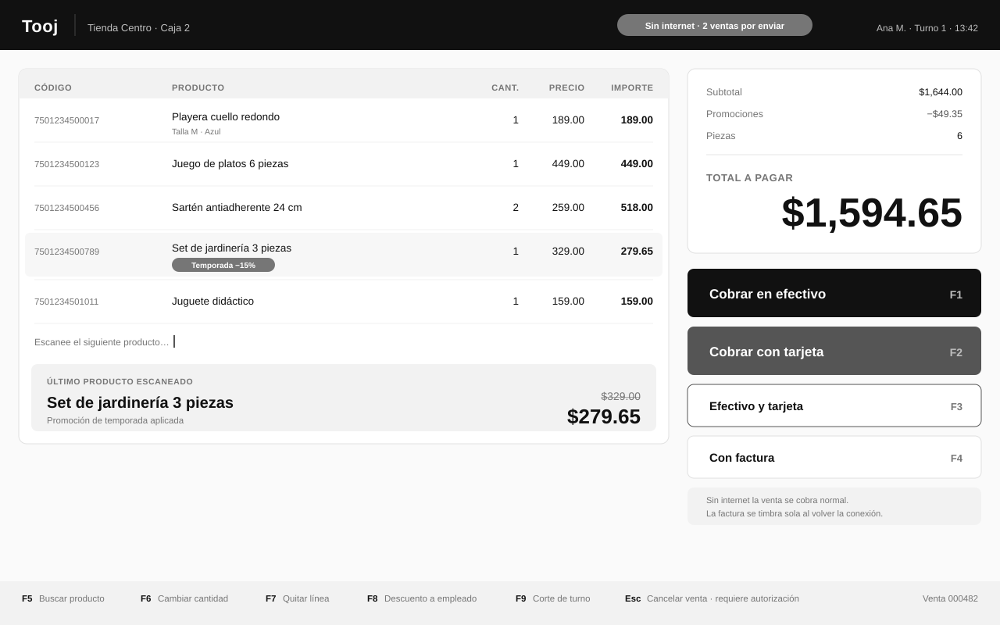
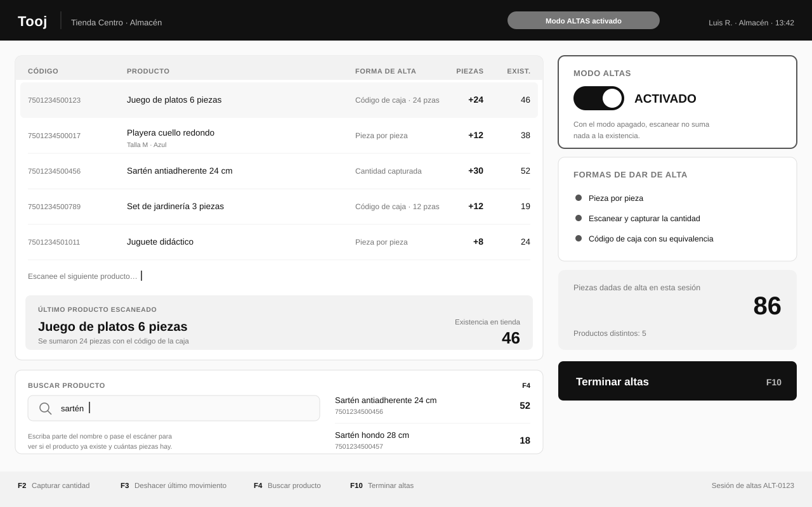
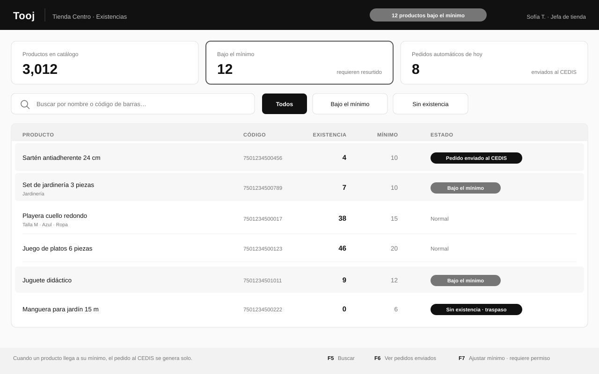
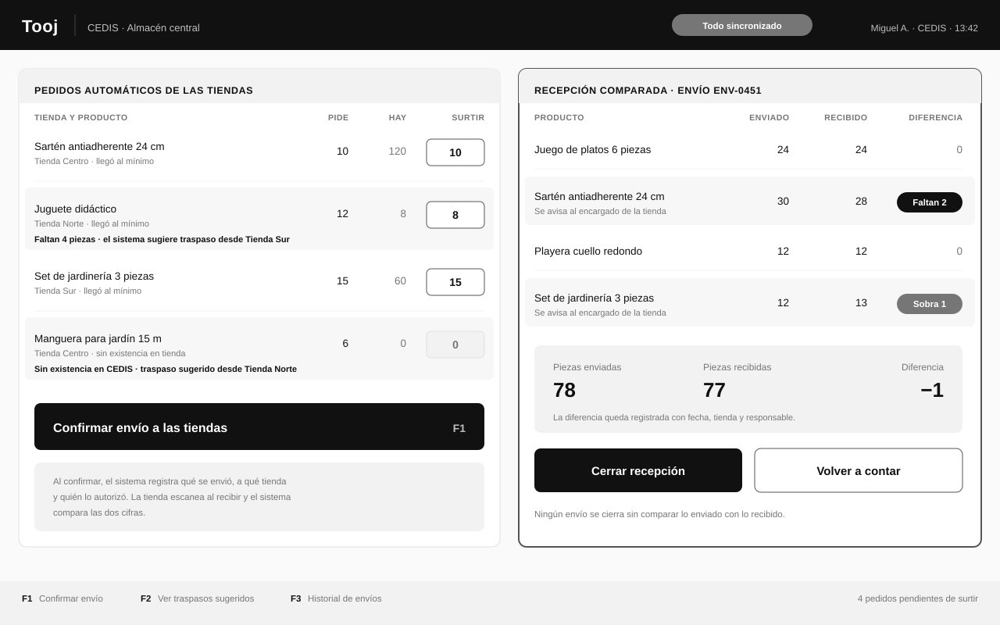
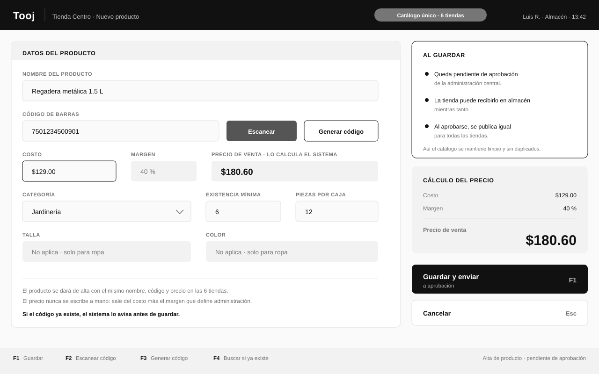
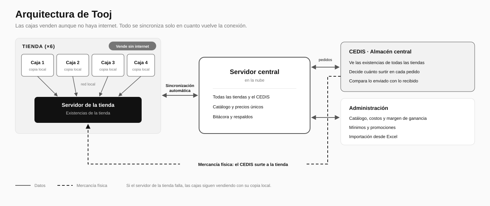

  

  

 

## El problema

En una cadena de tiendas, la información de las ventas y del almacén pasa por varios sistemas antes de llegar al almacén central. En cada salto se pierde información y **las existencias dejan de cuadrar**: a veces sobra mercancía, a veces falta, y nadie sabe en qué punto se perdió.

El resultado se paga todos los días: pedidos de resurtido equivocados, tiendas sin producto para vender y conteos manuales que cuestan horas.

## La solución

Tooj cubre **todo el circuito con un solo sistema**:

**Alta → Venta → Baja → Pedido → Envío → Recepción**

Cada movimiento queda registrado en el mismo lugar, así que las cifras no dependen de que un sistema le pase datos a otro.

| | |
|---|---|
| **Vende sin internet** | Si se cae la conexión, la caja sigue trabajando y todo se sincroniza solo al volver. |
| **Las existencias cuadran** | Lo enviado se compara con lo recibido. Las diferencias aparecen el mismo día. |
| **Un solo sistema** | De la caja al almacén central, sin traspasos entre programas distintos. |
| **Listo para 6 tiendas** | 24 cajas, un almacén central y catálogo único para todas. |

 

## Qué hace

### Caja

- Venta con escáner de código de barras
- Cobro en efectivo, con tarjeta o combinando ambos
- Ticket automático al aprobarse el pago
- Promociones y descuento a empleados
- Cancelaciones y devoluciones con autorización
- Corte por turno con fondo inicial
- **Sigue vendiendo sin internet**

### Almacén de la tienda

El modo Altas se activa con un botón: solo entonces los escaneos suman existencia. Se puede dar de alta pieza por pieza, capturando la cantidad o con el código de la caja completa. El buscador permite comprobar al momento si un producto ya existe y cuántas piezas hay.

### Existencias y mínimos

Cada tienda ve sus existencias y qué productos llegaron a su mínimo. El pedido al almacén central se genera solo.

### Almacén central

Los pedidos llegan solos desde las tiendas. Lo enviado se compara contra lo recibido y las diferencias quedan registradas con fecha, tienda y responsable. Si el almacén central no tiene un producto, el sistema propone traerlo de otra tienda.

### Catálogo y precios

La tienda captura el producto y queda pendiente de aprobación de la administración. Solo se escribe el costo: el precio de venta lo calcula el sistema con el margen, igual para todas las tiendas. Si el código ya existe, el sistema avisa antes de guardar.

 

## Cómo está construido

- **Cajas:** aplicación de escritorio para Windows, cada una con su propia copia de la información.
- **Servidor de tienda:** concentra las existencias; las cajas trabajan contra él por red local.
- **Servidor central:** en la nube, reúne las tiendas y el almacén central.
- **Sincronización automática:** lo que ocurre sin conexión se envía en cuanto vuelve el internet.
- Si el servidor de la tienda falla, **las cajas siguen vendiendo**.

 

## Cómo se entrega

El sistema se construye **por etapas**, con avances visibles y una prueba real en tienda antes de continuar.

| Etapa | Qué incluye |
|---|---|
| **1** | Caja, almacén de tienda, almacén central, pedidos automáticos, envíos comparados y sincronización |
| **2** | Promociones, descuento a empleados y traspasos entre tiendas |
| **3** | Facturación electrónica y terminal bancaria |
| **4** | Puesta en marcha en todas las tiendas |

 

## Contacto

*(Pendiente)*

 

---

**Tooj** · Todo cuadra.

© 2026. Todos los derechos reservados.

